# Software Development Analytics - Architectural Design Document

## 1. System Overview

The Software Development Analytics (SDA) Framework is a comprehensive code analysis platform that transforms source code repositories into intelligent, queryable knowledge bases. The system employs a multi-layered architecture combining traditional relational databases, graph databases, and AI-powered analysis.

**Status**: ✅ **Implemented** - Core system is fully operational with all primary features

## 2. Core Architecture

### 2.1 Design Patterns

#### Facade Pattern
**Status**: ✅ **Implemented**

The `CodeAnalysisFramework` class serves as the primary facade, providing a unified interface to all subsystems:
- Simplifies complex interactions between services
- Centralizes task management and coordination
- Provides consistent API for external clients

#### Repository Pattern
**Status**: ✅ **Implemented**

Database operations are abstracted through the `DatabaseManager`:
- Manages multiple database connections (PostgreSQL, Dgraph)
- Provides schema-aware session management
- Handles transactions and connection pooling

#### Strategy Pattern
**Status**: ✅ **Implemented**

Multiple services implement specific analysis strategies:
- `TokenAwareChunker` for code segmentation
- `SmartPartitioningService` for repository organization
- `EnhancedAnalysisEngine` for semantic analysis

#### Observer Pattern
**Status**: ✅ **Implemented**

Task management system for long-running operations:
- Real-time progress tracking
- Status updates and notifications
- Parent-child task relationships

### 2.2 System Components

**Status**: ✅ **Implemented** - All layers operational

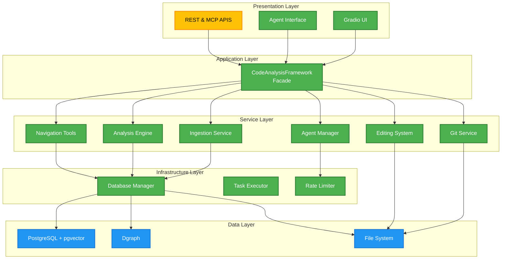

**Implementation Notes**:
- REST & MCP APIs: 📅 **Planned** - Currently using Gradio interface, REST & MCP APIs planned for production deployment

## 3. Data Architecture

### 3.1 Multi-Database Strategy

**Status**: ✅ **Implemented** - All databases operational

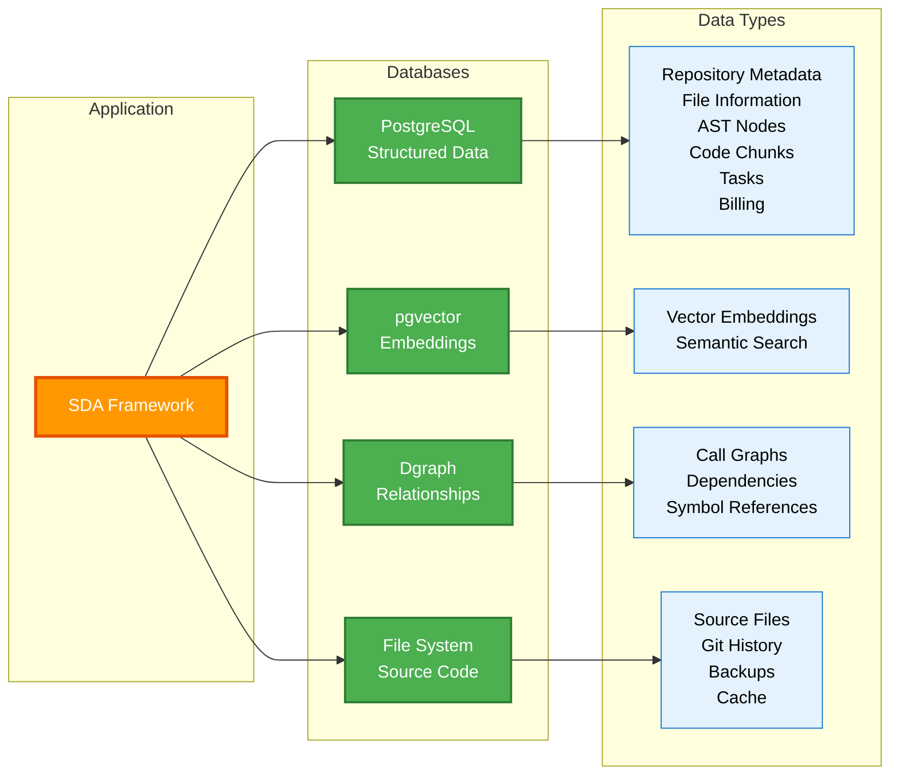

#### PostgreSQL (Primary Database)
**Status**: ✅ **Implemented**
- **Purpose**: Structured metadata, file information, code chunks
- **Features**: ACID compliance, vector extensions (pgvector), complex queries
- **Tables**: Repository, File, ASTNode, DBCodeChunk, Task, BillingUsage

#### Dgraph (Graph Database)
**Status**: ✅ **Implemented**
- **Purpose**: Code relationships, call graphs, dependency mapping
- **Features**: Fast graph traversals, relationship queries
- **Data**: AST nodes with call relationships, symbol references

#### File System
**Status**: ✅ **Implemented**
- **Purpose**: Source code storage, backups, caching
- **Features**: Direct file access, git integration, temporary processing

### 3.2 Schema Partitioning Strategy

**Status**: ✅ **Implemented** - Automatic partitioning operational

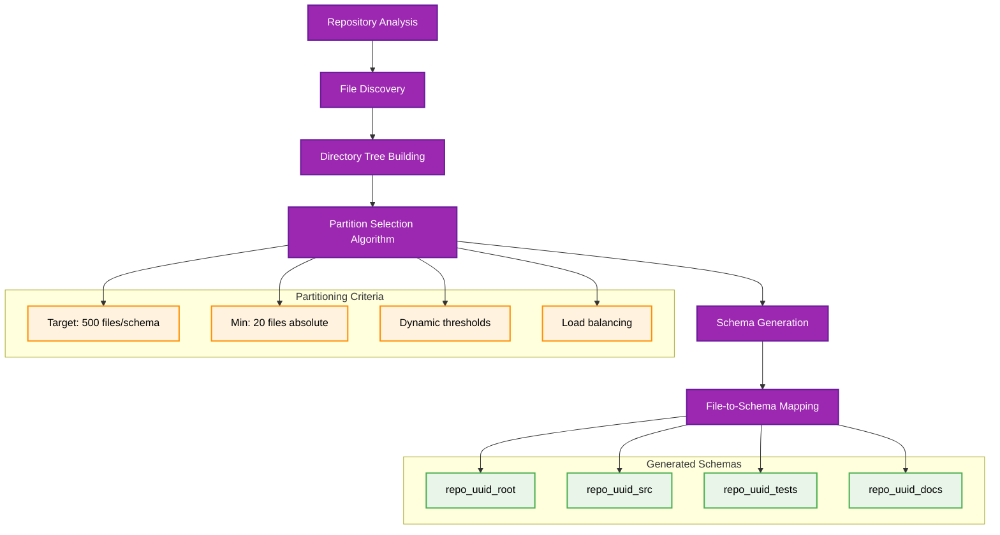

The system implements intelligent schema partitioning for large repositories:

```python
# Schema naming pattern
schema_name = f"repo_{uuid[:8]}_{sanitized_path}"

# Partitioning criteria
- Target: 500 files per schema
- Minimum: 20 files (configurable)
- Maximum depth: Based on repository structure
- Load balancing: Distributed across schemas
```

#### Benefits
- **Performance**: Parallel processing across partitions
- **Scalability**: Handles repositories with 100K+ files
- **Isolation**: Schema-level separation for different components
- **Maintenance**: Independent schema management

### 3.3 Vector Storage Design

**Status**: ✅ **Implemented** - pgvector integration complete

Code embeddings are stored using pgvector for semantic search:

```sql
-- Vector column with configurable dimensions
embedding VECTOR(1024)  -- Dimension from embedding model config

-- Optimized for similarity search
CREATE INDEX ON code_chunks USING ivfflat (embedding);
```

**Implementation Notes**:
- Advanced indexing: 📅 **Planned** - HNSW indexing for better performance at scale

## 4. Processing Pipeline

### 4.1 Ingestion Workflow

**Status**: ✅ **Implemented** - Full pipeline operational

```mermaid
flowchart TD
    A[Repository Input] --> B[Git Operations]
    B --> C[File Discovery]
    C --> D[Smart Partitioning]
    D --> E[Parallel Parsing]
    E --> F[Database Storage]
    F --> G[Vector Embedding]
    G --> H[Graph Building]
    H --> I[Completion]
    
    subgraph "Git Operations"
        B1[Clone/Pull]
        B2[Checkout Branch]
        B3[Validate Repository]
    end
    
    subgraph "File Discovery"
        C1[Language Filtering]
        C2[Ignore Patterns]
        C3[File Statistics]
    end
    
    subgraph "Smart Partitioning"
        D1[Directory Analysis]
        D2[Schema Assignment]
        D3[Load Balancing]
    end
    
    subgraph "Parallel Parsing"
        E1[AST Extraction]
        E2[Code Chunking]
        E3[Metadata Generation]
    end
    
    subgraph "Database Storage"
        F1[File Records]
        F2[AST Nodes]
        F3[Code Chunks]
    end
    
    subgraph "Vector Embedding"
        G1[Batch Processing]
        G2[Multi-Device]
        G3[Persistence]
    end
    
    subgraph "Graph Building"
        H1[Node Creation]
        H2[Edge Generation]
        H3[Relationship Mapping]
    end
    
    B --> B1
    B --> B2
    B --> B3
    C --> C1
    C --> C2
    C --> C3
    D --> D1
    D --> D2
    D --> D3
    E --> E1
    E --> E2
    E --> E3
    F --> F1
    F --> F2
    F --> F3
    G --> G1
    G --> G2
    G --> G3
    H --> H1
    H --> H2
    H --> H3
    
    style A fill:#FF5722,stroke:#D84315,stroke-width:3px,color:#fff
    style B fill:#3F51B5,stroke:#1A237E,stroke-width:2px,color:#fff
    style C fill:#3F51B5,stroke:#1A237E,stroke-width:2px,color:#fff
    style D fill:#3F51B5,stroke:#1A237E,stroke-width:2px,color:#fff
    style E fill:#3F51B5,stroke:#1A237E,stroke-width:2px,color:#fff
    style F fill:#3F51B5,stroke:#1A237E,stroke-width:2px,color:#fff
    style G fill:#3F51B5,stroke:#1A237E,stroke-width:2px,color:#fff
    style H fill:#3F51B5,stroke:#1A237E,stroke-width:2px,color:#fff
    style I fill:#4CAF50,stroke:#2E7D32,stroke-width:3px,color:#fff
    style B1 fill:#E3F2FD,stroke:#1976D2,stroke-width:1px,color:#000
    style B2 fill:#E3F2FD,stroke:#1976D2,stroke-width:1px,color:#000
    style B3 fill:#E3F2FD,stroke:#1976D2,stroke-width:1px,color:#000
    style C1 fill:#E3F2FD,stroke:#1976D2,stroke-width:1px,color:#000
    style C2 fill:#E3F2FD,stroke:#1976D2,stroke-width:1px,color:#000
    style C3 fill:#E3F2FD,stroke:#1976D2,stroke-width:1px,color:#000
    style D1 fill:#E3F2FD,stroke:#1976D2,stroke-width:1px,color:#000
    style D2 fill:#E3F2FD,stroke:#1976D2,stroke-width:1px,color:#000
    style D3 fill:#E3F2FD,stroke:#1976D2,stroke-width:1px,color:#000
    style E1 fill:#E3F2FD,stroke:#1976D2,stroke-width:1px,color:#000
    style E2 fill:#E3F2FD,stroke:#1976D2,stroke-width:1px,color:#000
    style E3 fill:#E3F2FD,stroke:#1976D2,stroke-width:1px,color:#000
    style F1 fill:#E3F2FD,stroke:#1976D2,stroke-width:1px,color:#000
    style F2 fill:#E3F2FD,stroke:#1976D2,stroke-width:1px,color:#000
    style F3 fill:#E3F2FD,stroke:#1976D2,stroke-width:1px,color:#000
    style G1 fill:#E3F2FD,stroke:#1976D2,stroke-width:1px,color:#000
    style G2 fill:#E3F2FD,stroke:#1976D2,stroke-width:1px,color:#000
    style G3 fill:#E3F2FD,stroke:#1976D2,stroke-width:1px,color:#000
    style H1 fill:#E3F2FD,stroke:#1976D2,stroke-width:1px,color:#000
    style H2 fill:#E3F2FD,stroke:#1976D2,stroke-width:1px,color:#000
    style H3 fill:#E3F2FD,stroke:#1976D2,stroke-width:1px,color:#000
```

### 4.2 Concurrent Processing

**Status**: ✅ **Implemented** - Multi-level concurrency operational

The system employs multiple levels of concurrency:

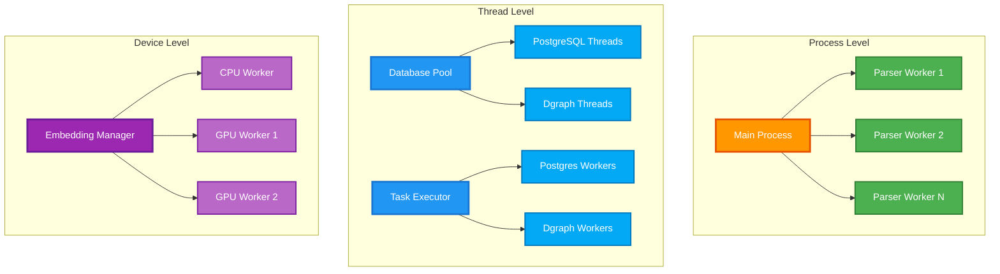

#### Process-Level Parallelism
**Status**: ✅ **Implemented**
- **CPU-bound**: File parsing using `ProcessPoolExecutor`
- **Isolation**: Each process has independent chunker instances
- **Scalability**: Configurable worker count (up to 48 processes)

#### Thread-Level Parallelism
**Status**: ✅ **Implemented**
- **I/O-bound**: Database operations using `ThreadPoolExecutor`
- **Bulkhead Pattern**: Separate thread pools for different databases
- **Configuration**: Per-database worker limits

#### Task-Level Parallelism
**Status**: ✅ **Implemented**
- **Embedding**: Multi-GPU/CPU device utilization
- **Persistence**: Batched operations with deadlock avoidance
- **Monitoring**: Real-time progress tracking

### 4.3 Memory Management

**Status**: ✅ **Implemented** - Comprehensive memory management

#### Streaming Processing
**Status**: ✅ **Implemented**
- **Large Files**: Chunk-based processing to avoid memory overflow
- **Batch Processing**: Configurable batch sizes for different operations
- **Cleanup**: Explicit memory management and garbage collection

#### Caching Strategy
**Status**: ✅ **Implemented**
- **Parse Cache**: Temporary files for intermediate results
- **Model Cache**: Lazy loading of AI models
- **Schema Cache**: Vector store instance caching

**Implementation Notes**:
- Advanced caching: 📅 **Planned** - Redis integration for distributed caching in production

## 5. AI Integration

### 5.1 Model Architecture

**Status**: ✅ **Implemented** - Full AI integration operational

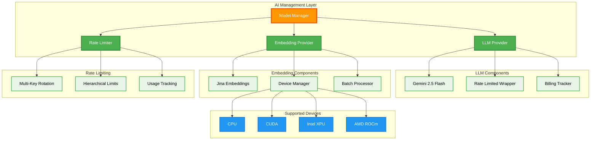

#### Language Models (LLMs)
**Status**: ✅ **Implemented**
- **Primary**: Google Gemini 2.5 Flash (configurable)
- **Features**: Rate limiting, API key rotation, billing tracking
- **Wrapper**: `RateLimitedGemini` for enhanced control

#### Embedding Models
**Status**: ✅ **Implemented**
- **Primary**: Jina Embeddings (local deployment)
- **Features**: Multi-device support (CPU, CUDA, XPU, ROCm)
- **Optimization**: Model quantization and caching

**Implementation Notes**:
- Additional LLM providers: 📅 **Planned** - OpenAI, Anthropic, local models
- Advanced embedding models: 📅 **Planned** - Code-specific fine-tuned models

### 5.2 Agent System

**Status**: ✅ **Implemented** - Complete agent functionality

```mermaid
graph TB
    subgraph "Agent Architecture"
        A[Agent Manager] --> B[Tool Registry]
        A --> C[Context Manager]
        A --> D[Response Generator]
    end
    
    subgraph "Available Tools"
        B --> E[Code Search]
        B --> F[Symbol Navigation]
        B --> G[File Operations]
        B --> H[Analysis Tools]
        B --> I[Git Operations]
    end
    
    subgraph "Code Search Tools"
        E --> J[Semantic Search]
        E --> K[Symbol Search]
        E --> L[Full-text Search]
    end
    
    subgraph "Navigation Tools"
        F --> M[Find Definition]
        F --> N[Find References]
        F --> O[Call Hierarchy]
        F --> P[File Outline]
    end
    
    subgraph "Analysis Tools"
        H --> Q[Dead Code Detection]
        H --> R[Duplicate Analysis]
        H --> S[Repository Stats]
        H --> T[Graph Analysis]
    end
    
    style A fill:#FF9800,stroke:#E65100,stroke-width:3px,color:#fff
    style B fill:#4CAF50,stroke:#2E7D32,stroke-width:2px,color:#fff
    style C fill:#4CAF50,stroke:#2E7D32,stroke-width:2px,color:#fff
    style D fill:#4CAF50,stroke:#2E7D32,stroke-width:2px,color:#fff
    style E fill:#2196F3,stroke:#1976D2,stroke-width:2px,color:#fff
    style F fill:#2196F3,stroke:#1976D2,stroke-width:2px,color:#fff
    style G fill:#2196F3,stroke:#1976D2,stroke-width:2px,color:#fff
    style H fill:#2196F3,stroke:#1976D2,stroke-width:2px,color:#fff
    style I fill:#2196F3,stroke:#1976D2,stroke-width:2px,color:#fff
    style J fill:#E3F2FD,stroke:#1976D2,stroke-width:1px,color:#000
    style K fill:#E3F2FD,stroke:#1976D2,stroke-width:1px,color:#000
    style L fill:#E3F2FD,stroke:#1976D2,stroke-width:1px,color:#000
    style M fill:#E3F2FD,stroke:#1976D2,stroke-width:1px,color:#000
    style N fill:#E3F2FD,stroke:#1976D2,stroke-width:1px,color:#000
    style O fill:#E3F2FD,stroke:#1976D2,stroke-width:1px,color:#000
    style P fill:#E3F2FD,stroke:#1976D2,stroke-width:1px,color:#000
    style Q fill:#E3F2FD,stroke:#1976D2,stroke-width:1px,color:#000
    style R fill:#E3F2FD,stroke:#1976D2,stroke-width:1px,color:#000
    style S fill:#E3F2FD,stroke:#1976D2,stroke-width:1px,color:#000
    style T fill:#E3F2FD,stroke:#1976D2,stroke-width:1px,color:#000
```

The AI agent provides natural language interface to code analysis:

#### Tool Integration
**Status**: ✅ **Implemented**
- **Code Search**: Semantic and symbol-based search
- **Navigation**: Definition finding, reference tracing
- **Analysis**: Dead code detection, duplicate identification
- **Repository**: File listing, content retrieval

#### Context Management
**Status**: ✅ **Implemented**
- **Branch Awareness**: Queries scoped to specific branches
- **History**: Conversation context preservation
- **Streaming**: Real-time response generation

### 5.3 Rate Limiting

**Status**: ✅ **Implemented** - Sophisticated rate limiting system

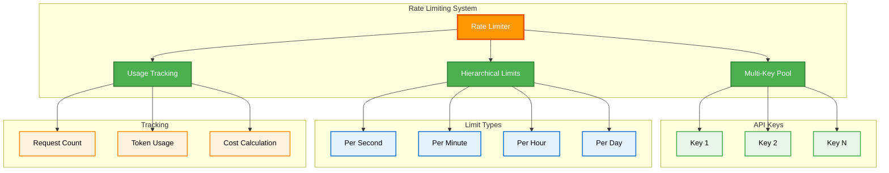

Sophisticated rate limiting prevents API abuse:

```python
# Multi-level rate limits
rate_limits = [
    LLMRateLimit(requests=1, period_seconds=1),    # Per-second
    LLMRateLimit(requests=60, period_seconds=60)   # Per-minute
]

# API key rotation
keys = ["key1", "key2", "key3"]
# Automatic rotation on limit hits
```

## 6. Quality Assurance

### 6.1 Code Safety

**Status**: ✅ **Implemented** - Complete safety system

#### File Editing System
**Status**: ✅ **Implemented**
- **Backup Creation**: Timestamped backups before modifications
- **Syntax Validation**: Tree-sitter based validation
- **Atomic Operations**: Rollback on failure
- **Database Synchronization**: Automatic re-ingestion triggers

#### Error Handling
**Status**: ✅ **Implemented**
- **Graceful Degradation**: Fallback mechanisms for service failures
- **Logging**: Comprehensive error tracking and debugging
- **Recovery**: Automatic retry with exponential backoff

### 6.2 Performance Monitoring

**Status**: ⚠️ **Partially Implemented** - Basic monitoring active

#### Metrics Collection
**Status**: ✅ **Implemented**
- **Processing Speed**: Files/chunks per second
- **Resource Usage**: Memory, CPU, GPU utilization
- **Database Performance**: Query times, connection pools
- **Cost Tracking**: API usage and billing

#### Profiling Tools
**Status**: ✅ **Implemented**
- **ThroughputLogger**: Real-time performance metrics
- **Progress Tracking**: Detailed task progression
- **Resource Monitoring**: System resource utilization

**Implementation Notes**:
- Advanced monitoring: 📅 **Planned** - Prometheus/Grafana integration for production
- Performance analytics: 📅 **Planned** - Historical performance tracking and optimization recommendations

## 7. Security Considerations

### 7.1 Data Protection

**Status**: ✅ **Implemented** - Comprehensive security measures

#### Local Processing
**Status**: ✅ **Implemented**
- **No External Data**: Code never leaves local environment
- **Secure Storage**: Encrypted database connections
- **Access Control**: Schema-level isolation

#### API Security
**Status**: ✅ **Implemented**
- **Key Management**: Secure API key storage and rotation
- **Rate Limiting**: Prevent abuse and cost overruns
- **Audit Logging**: Track all API usage

### 7.2 Input Validation

**Status**: ✅ **Implemented**

#### Code Analysis
**Status**: ✅ **Implemented**
- **Syntax Validation**: Tree-sitter based parsing
- **Content Filtering**: Malicious code detection
- **Size Limits**: Prevent resource exhaustion

#### User Input
**Status**: ✅ **Implemented**
- **Query Sanitization**: Prevent injection attacks
- **Parameter Validation**: Type checking and bounds
- **Error Handling**: Secure error messages

**Implementation Notes**:
- Advanced security: 📅 **Planned** - OAuth integration, RBAC system for production deployment

## 8. Scalability Design

### 8.1 Horizontal Scaling

**Status**: ⚠️ **Partially Implemented** - Core scaling features active

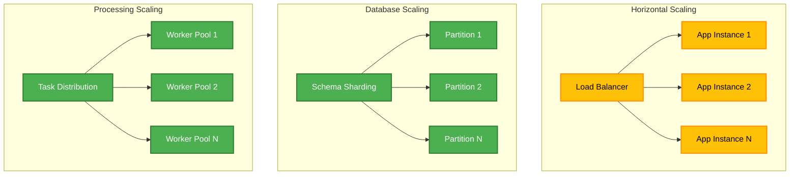

#### Database Partitioning
**Status**: ✅ **Implemented**
- **Schema Sharding**: Automatic partition creation
- **Load Balancing**: Even distribution across partitions
- **Independent Scaling**: Per-partition resource allocation

#### Processing Distribution
**Status**: ✅ **Implemented**
- **Multi-Process**: CPU-bound task distribution
- **Multi-Thread**: I/O-bound task distribution
- **Multi-Device**: GPU/accelerator utilization

**Implementation Notes**:
- Application scaling: 📅 **Planned** - Kubernetes deployment with auto-scaling
- Database clustering: 📅 **Planned** - PostgreSQL clustering for high availability

### 8.2 Vertical Scaling

**Status**: ✅ **Implemented** - Comprehensive resource optimization

#### Resource Optimization
**Status**: ✅ **Implemented**
- **Memory Efficiency**: Streaming processing for large datasets
- **CPU Utilization**: Parallel processing pipelines
- **Storage Optimization**: Efficient indexing and compression

#### Configuration Flexibility
**Status**: ✅ **Implemented**
- **Tunable Parameters**: Batch sizes, worker counts, memory limits
- **Environment Adaptation**: Auto-detection of available resources
- **Performance Profiles**: Optimized configurations for different use cases

## 9. Future Enhancements

### 9.1 Planned Features

#### Advanced Analytics
**Status**: 📅 **Planned** - Next major release

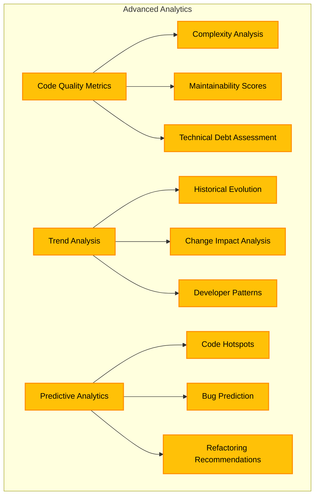

- **Code Quality Metrics**: Complexity analysis, maintainability scores
- **Trend Analysis**: Historical code evolution tracking
- **Predictive Analytics**: Code hotspot identification

#### Enhanced AI
**Status**: 📅 **Planned** - Long-term roadmap

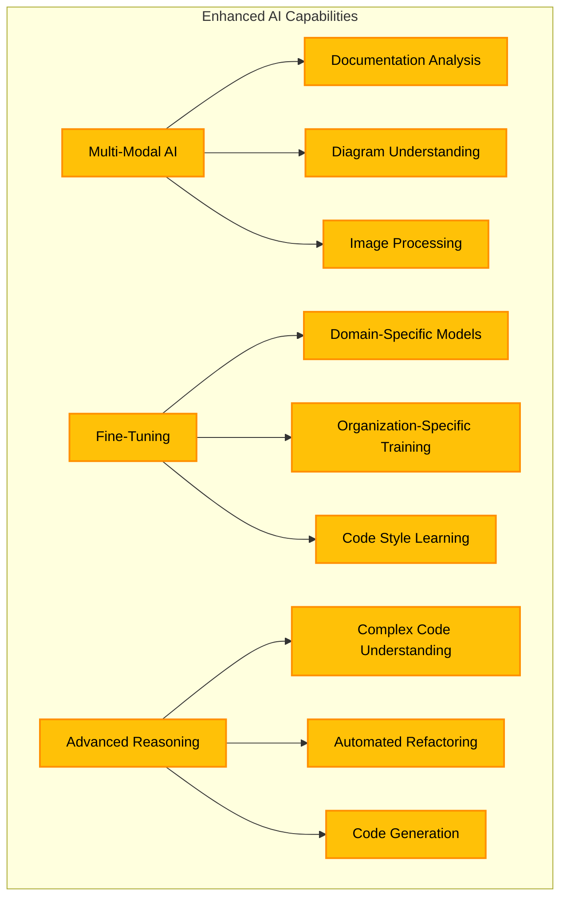

- **Multi-Modal**: Support for documentation, diagrams, images
- **Fine-Tuning**: Domain-specific model customization
- **Advanced Reasoning**: Complex code understanding and generation

### 9.2 Integration Possibilities

#### Development Tools
**Status**: 📅 **Planned** - Plugin development roadmap

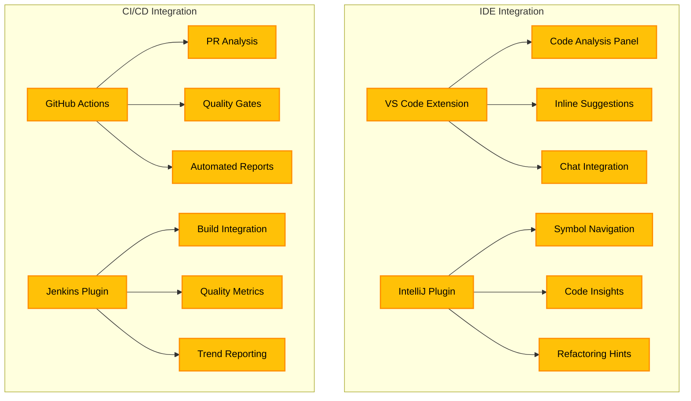

- **IDE Plugins**: VS Code, IntelliJ integration
- **CI/CD**: Pipeline integration for automated analysis
- **Code Review**: Pull request analysis and suggestions

#### Enterprise Features
**Status**: 📅 **Planned** - Enterprise edition roadmap

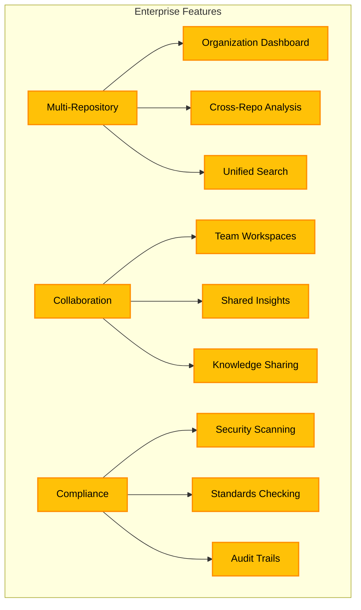

- **Multi-Repository**: Organization-wide analysis
- **Collaboration**: Team-based code exploration
- **Compliance**: Security and standards checking

## 10. Deployment Architecture

### 10.1 Development Environment

**Status**: ✅ **Implemented** - Complete development setup

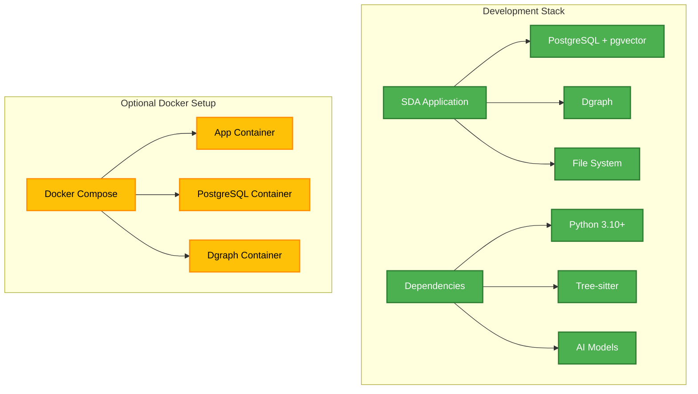

```yaml
# Docker Compose Structure (Planned)
services:
  app:
    build: .
    ports: ["7860:7860"]
    depends_on: [postgres, dgraph]
    
  postgres:
    image: pgvector/pgvector:pg16
    environment:
      POSTGRES_DB: ami_sda_db
      
  dgraph:
    image: dgraph/dgraph:latest
    ports: ["8080:8080", "9080:9080"]
```

### 10.2 Production Considerations

**Status**: 📅 **Planned** - Production deployment roadmap

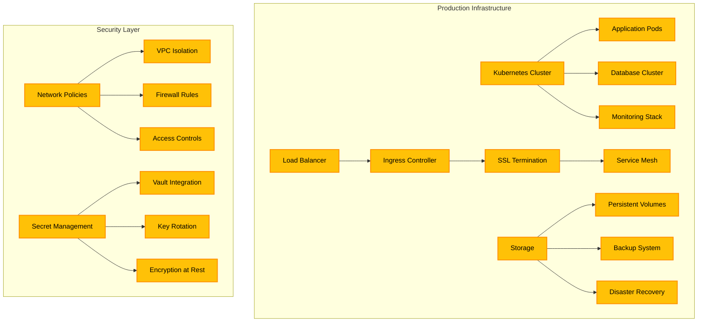

#### Infrastructure
**Status**: 📅 **Planned** - Production deployment features
- **Container Orchestration**: Kubernetes deployment
- **Load Balancing**: Multi-instance deployment
- **Monitoring**: Prometheus/Grafana integration
- **Backup**: Automated database backups

#### Security
**Status**: 📅 **Planned** - Enterprise security features
- **Network Isolation**: VPC/subnet configuration
- **SSL/TLS**: Encrypted communications
- **Secret Management**: Vault integration
- **Access Control**: Role-based permissions

## Implementation Status Summary

### ✅ **Fully Implemented**
- Core application framework and facade pattern
- Multi-database architecture (PostgreSQL, Dgraph, pgvector)
- Smart repository partitioning and schema management
- Complete ingestion pipeline with concurrent processing
- AI integration with rate limiting and billing tracking
- Agent system with comprehensive tool integration
- File editing system with safety features
- Git integration and version control
- Web UI with real-time progress tracking
- Performance monitoring and profiling tools

### ⚠️ **Partially Implemented**
- Advanced performance monitoring (basic metrics available)
- Horizontal scaling (database sharding ready, application scaling planned)

### 📅 **Planned Features**
- REST & MCP APIs for external integration
- Docker containerization
- Advanced caching with Redis
- Additional LLM and embedding providers
- Advanced analytics and code quality metrics
- Multi-modal AI capabilities
- IDE plugins and CI/CD integration
- Enterprise features and compliance tools
- Kubernetes deployment and production infrastructure
- Advanced security features for enterprise deployment

This architecture provides a robust, scalable foundation for advanced code analysis while maintaining a clear roadmap for future enhancements and production deployment scenarios.