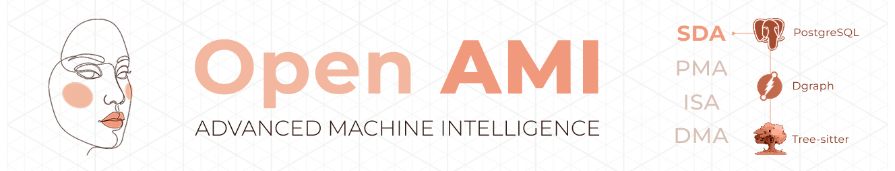
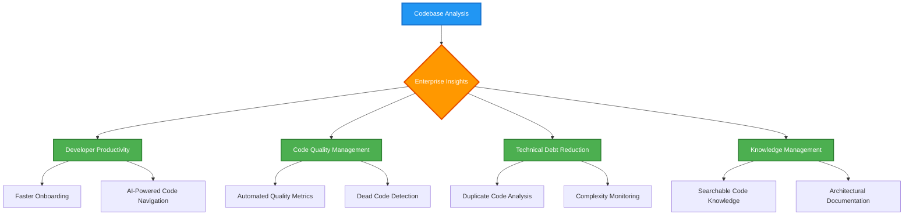
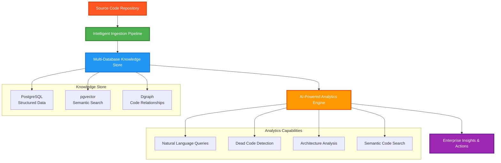

# Software Development Analytics (SDA) Framework

**Transform your codebase into an intelligent, queryable knowledge base with advanced AI and graph analytics**

[](LICENSE)
[](https://python.org)
[](https://postgresql.org)
[](https://dgraph.io)

## Executive Summary

The Software Development Analytics (SDA) Framework is an enterprise-grade, open-source platform that revolutionizes how
organizations understand, navigate, and optimize their codebases. By combining advanced AST parsing, semantic analysis,
graph databases, and AI-powered insights, SDA transforms static code repositories into dynamic, intelligent knowledge
bases.

### 🏢 Enterprise Value Delivery



### Business Value

- **Accelerate Developer Onboarding**: Reduce time-to-productivity with AI-powered code exploration
- **Enhance Code Quality**: Identify technical debt, dead code, and architectural issues automatically
- **Improve Decision Making**: Data-driven insights into code complexity, dependencies, and evolution
- **Reduce Maintenance Costs**: Proactive identification of refactoring opportunities and code smells
- **Scale Knowledge Management**: Centralized, searchable repository of organizational code knowledge

## Technical Architecture



## Core Capabilities

### 📊 Analytics & Insights

The framework provides comprehensive code analytics through multiple specialized engines:

- **Dead Code Detection**: Identify potentially unused functions, classes, and modules
- **Duplicate Code Analysis**: Find semantically similar code patterns for refactoring opportunities
- **Complexity Analysis**: Measure cyclomatic complexity and technical debt
- **Dependency Mapping**: Visualize and analyze code dependencies and call graphs
- **Evolution Tracking**: Monitor code changes and architectural evolution over time

## Enterprise Features

### 🏢 Scalability & Performance

- **Smart Partitioning**: Automatic schema partitioning for repositories with 100K+ files
- **Concurrent Processing**: Multi-level parallelization (process, thread, device)
- **Resource Optimization**: Intelligent memory management and streaming processing
- **Horizontal Scaling**: Database sharding and distributed processing capabilities

### 🔒 Security & Compliance

- **Local Processing**: Code never leaves your environment
- **Encrypted Storage**: Secure database connections and encrypted data at rest
- **Access Control**: Schema-level isolation and role-based permissions
- **Audit Logging**: Comprehensive activity tracking and compliance reporting

### 💰 Cost Management

- **API Cost Tracking**: Real-time monitoring of AI service usage and costs
- **Rate Limiting**: Intelligent API key rotation and usage optimization
- **Resource Monitoring**: CPU, memory, and storage utilization tracking
- **Billing Analytics**: Detailed cost analysis and optimization recommendations

## Quick Start

### Prerequisites

```bash
# System Requirements
Python 3.12+
PostgreSQL 16+ with pgvector extension
Dgraph 23.0+
20 CPU Cores (40+ recommended)
64GB+ RAM (128GB+ recommended)
```

### Installation

```bash
# 1. Clone the repository
git clone https://github.com/Independent-AI-Labs/AMI-SDA.git
cd AMI-SDA/sda

# 2. Install dependencies
pip install -r requirements.txt

# 3. Configure environment
cp .env.example .env
# Edit .env with your database and API credentials

# 4. Launch the application
python ui.py
```

### Docker Deployment

```bash
# Quick start with Docker Compose
docker-compose up -d

# Access the interface at http://localhost:7860
```

### First Repository Analysis

```python
from sda import CodeAnalysisFramework

# Initialize framework
framework = CodeAnalysisFramework()

# Add and analyze repository
repo = framework.add_repository("https://github.com/your-org/project.git")
task = framework.analyze_branch(repo.id, "main")

# Query your codebase
results = framework.search_code("authentication logic")
```

## Use Cases

### 🔍 **Code Discovery & Navigation**

- Quickly understand large, unfamiliar codebases
- Find relevant code examples and patterns
- Trace dependencies and call hierarchies
- Explore architectural relationships

### 📈 **Technical Debt Management**

- Identify dead code and unused dependencies
- Detect duplicate code patterns
- Analyze complexity trends over time
- Prioritize refactoring efforts

### 🎯 **Developer Productivity**

- Accelerate onboarding with AI-powered code exploration
- Reduce time spent searching for relevant code
- Provide contextual code recommendations
- Enable natural language code queries

### 🏛️ **Enterprise Governance**

- Monitor code quality metrics across projects
- Track technical debt and architectural evolution
- Ensure compliance with coding standards
- Generate automated documentation and reports

## Technology Stack

### Core Technologies

- **Backend**: Python 3.12+ with FastAPI-style architecture
- **Databases**: PostgreSQL 16+ with pgvector, Dgraph 23.0+
- **AI/ML**: Llama Index, Google Gemini, Jina Embeddings, sentence-transformers
- **Processing**: Tree-sitter for AST parsing, concurrent processing
- **Frontend**: Gradio-based web interface

### Supported Languages

- Python (.py)
- Java (.java)
- JavaScript (.js)
- TypeScript (.ts)
- Additional language support via extensible parser framework

## Community & Support

### 🤝 Contributing

- TBA

### 📚 Documentation

- [Architecture Guide](ARCHITECTURE.md)
- [Development Guidelines](DEVELOPMENT_GUIDELINES.md)

### 💬 Community

- TBA

## Roadmap

### 🚀 **Current Version (v0.1b)**

- ✅ Multi-language AST parsing and analysis
- ✅ AI-powered semantic search and chat
- ✅ Graph-based code navigation
- ✅ Dead code and duplicate detection
- ✅ Real-time processing pipeline

### 🔮 **Next Release (v0.2b)**

- 📅 REST & MCP APIs for external integrations
- 📅 Docker containerization
- 📅 Advanced performance monitoring
- 📅 Enhanced security features

### 🎯 **Future Releases**

- 📅 IDE plugins (VS Code, IntelliJ)
- 📅 CI/CD pipeline integration
- 📅 Multi-repository organization dashboards
- 📅 Advanced code quality analytics
- 📅 Kubernetes deployment support

## License

This project is licensed under the MIT License - see the [LICENSE](LICENSE) file for details.

## Citation

TODO

---

**Built with care by developers, for developers who want to understand their code better.**